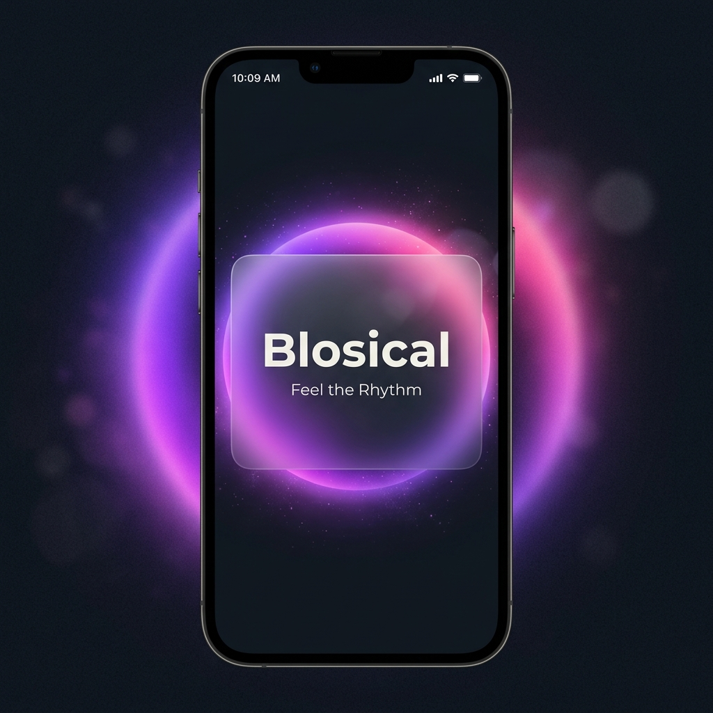
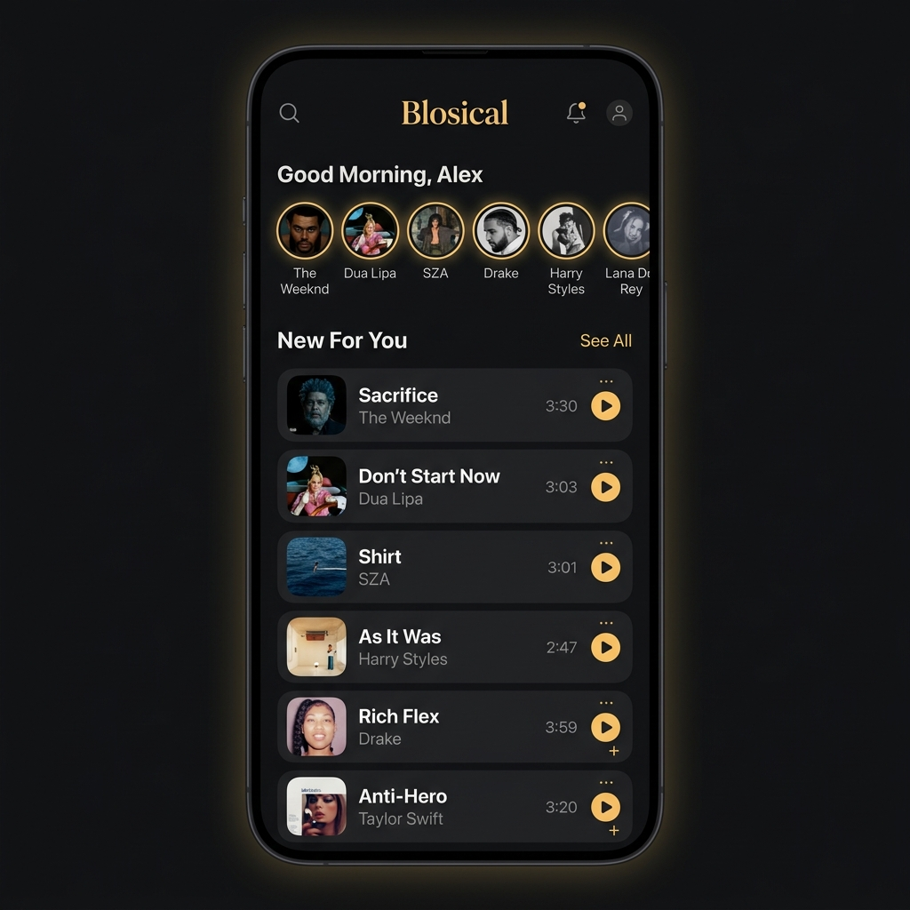
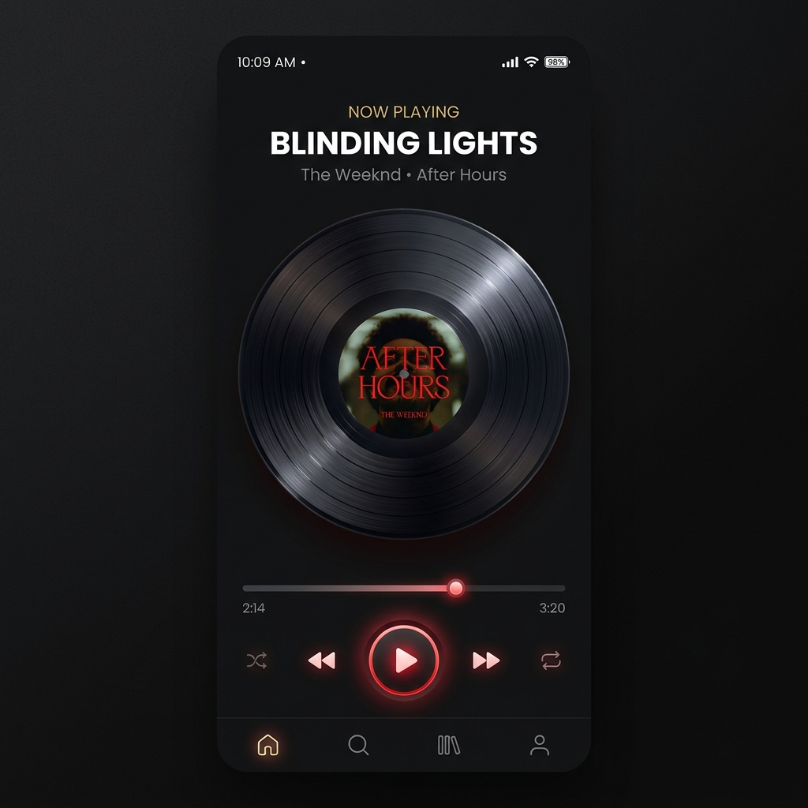
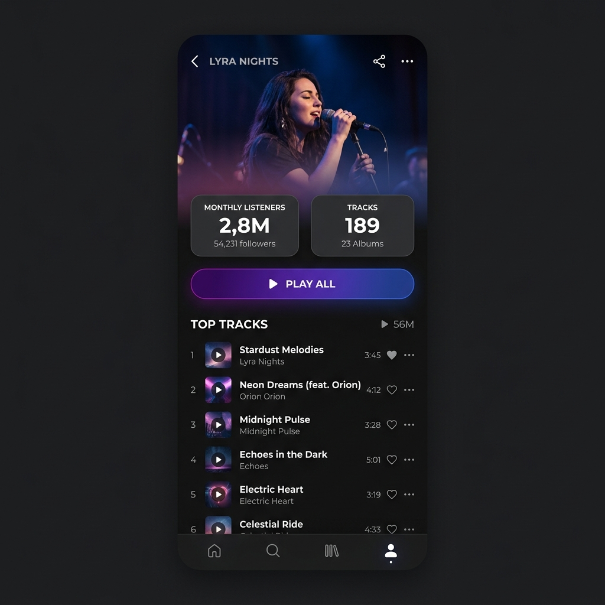

# 🎵 Mini Music App

A Flutter music player application built as part of a technical assessment. Features mock authentication, a home feed with track listings, a fully functional music player, artist profiles, and a favorites system with local persistence.

## Features

### Core
- **Mock Login** — Simple email/password authentication with form validation and persistent login state
- **Home Feed** — Displays a list of 10 tracks from mock data with album art, artist names, and durations
- **Music Player** — Full audio playback using `just_audio` with play/pause and seek bar controls
- **Artist Profile** — Detailed artist page with bio, monthly listeners, and their discography

### Bonus
- **Favorites** — Heart icon toggle on tracks with `SharedPreferences` persistence and a dedicated favorites tab
- **Session Restore** — Remembers the last played track and loads it on app reopen

### Player Behavior
- Only one track plays at a time
- Playing a new track automatically stops the previous one
- Currently playing track is visually highlighted with a green border and icon

## Architecture

The project follows an **MVVM (Model-View-ViewModel)** pattern with **feature-based** folder organization:

```
lib/
├── main.dart                      # Entry point, auth check, session restore
├── core/
│   ├── theme/app_theme.dart       # Dark theme, colors, typography
│   ├── models/                    # Data classes (TrackModel, ArtistModel)
│   └── widgets/                   # Reusable UI components
├── features/
│   ├── auth/                      # Login screen + auth viewmodel
│   ├── home/                      # Track feed + repository layer
│   ├── player/                    # Audio player + mini player + full screen
│   ├── artist/                    # Artist profile page
│   └── favorites/                 # Favorites list + persistence
└── data/
    └── mock_data.dart             # Mock tracks and artists
```

### Layer Separation
| Layer | Responsibility | Example |
|-------|---------------|---------|
| **View** | UI rendering, user interaction | `login_page.dart`, `home_page.dart` |
| **ViewModel** | Business logic, state management | `auth_viewmodel.dart`, `player_viewmodel.dart` |
| **Data/Repository** | Data access, mock API simulation | `home_repository.dart`, `mock_data.dart` |

## Tech Stack

| Library | Purpose | Why |
|---------|---------|-----|
| `flutter_riverpod` | State management | Clean separation of concerns, no boilerplate. Preferred over Provider for better testability. |
| `just_audio` | Audio playback | Most popular Flutter audio package. Handles streaming, seeking, and player state. |
| `shared_preferences` | Local persistence | Lightweight key-value store for favorites, login state, and session restore. |
| `cached_network_image` | Image caching | Smooth album art loading with placeholders and error fallbacks. |
| `google_fonts` | Typography | Professional Poppins font without bundling font files. |

## Getting Started

### Prerequisites
- Flutter SDK >= 3.4.0
- Dart SDK >= 3.4.0
- Android Studio / VS Code with Flutter extension

## Screenshots

<div align="center">
  
  
  
  
</div>

## License

This project was built for assessment purposes.
